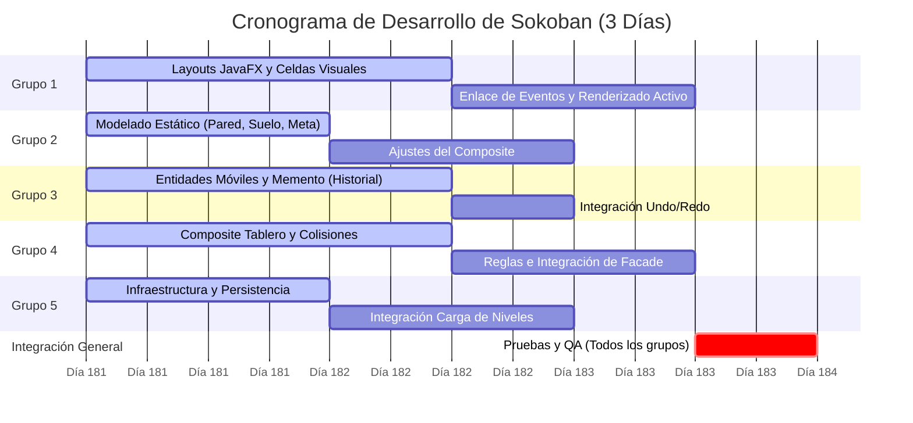

# Plan de División de Trabajo por Grupos de Desarrollo

Para finalizar la implementación del modelo MVC de Sokoban en un plazo estricto de **3 días**, se ha establecido la siguiente distribución equitativa de responsabilidades entre 5 grupos de desarrollo. Esta asignación maximiza la independencia de desarrollo, minimiza las dependencias críticas y define hitos claros de integración.

---

## Distribución de Clases y Tareas

### Grupo 1: Interfaz Gráfica y Renderizado (JavaFX - View MVC)
*   **Responsabilidad**: Crear la interfaz gráfica completa con JavaFX, renderizar los sprites o colores del tablero y manejar las transiciones de menús.
*   **Clases Asignadas**:
    *   `ec.edu.epn.sokoban.view.VentanaPrincipal`
    *   `ec.edu.epn.sokoban.view.MenuInicio`
    *   `ec.edu.epn.sokoban.view.PanelTablero`
    *   `ec.edu.epn.sokoban.MainApp`
    *   `ec.edu.epn.sokoban.Main`
*   **Tareas del Hito**:
    *   Crear la ventana JavaFX principal y las pantallas de menú de niveles y juego.
    *   Renderizar dinámicamente las casillas del tablero mapeando cada tipo (`Casilla`, `Caja`, `Personaje`, `Pared`, `Meta`, `SueloComun`) a su representación gráfica en celdas visuales.
    *   Conectar los eventos de teclado de la escena JavaFX con `ControladorTeclado`.

### Grupo 2: Núcleo del Mapa y Elementos Estáticos (Composite: Componente y Hojas Fijas)
*   **Responsabilidad**: Desarrollar la estructura jerárquica del mapa y los elementos estáticos que componen el entorno físico del juego.
*   **Clases Asignadas**:
    *   `ec.edu.epn.sokoban.model.escenario.Casilla` (Abstracta)
    *   `ec.edu.epn.sokoban.model.escenario.Pared`
    *   `ec.edu.epn.sokoban.model.escenario.SueloComun`
    *   `ec.edu.epn.sokoban.model.escenario.Meta`
*   **Tareas del Hito**:
    *   Establecer la clase base abstracta de la jerarquía Composite.
    *   Implementar las casillas estáticas con sus reglas básicas de transitabilidad.

### Grupo 3: Entidades Móviles y Estado del Juego (Composite: Hojas Móviles e Historial Memento)
*   **Responsabilidad**: Codificar los elementos dinámicos que cambian de posición en el mapa y la captura del estado (snapshots) para el deshacer de acciones.
*   **Clases Asignadas**:
    *   `ec.edu.epn.sokoban.model.escenario.Caja`
    *   `ec.edu.epn.sokoban.model.escenario.Personaje`
    *   `ec.edu.epn.sokoban.model.historial.Nivel`
    *   `ec.edu.epn.sokoban.model.historial.PartidaMomento`
    *   `ec.edu.epn.sokoban.model.historial.HistorialMovimientos`
*   **Tareas del Hito**:
    *   Implementar las entidades móviles (caja, personaje) que forman parte de la estructura Composite.
    *   Implementar la captura del estado mutable de la partida en una instantánea (`PartidaMomento`) y el historial en pila (`HistorialMovimientos`).

### Grupo 4: Motor de Reglas, Colisiones y Controladores (Facade del Modelo, Colisiones y Controller MVC)
*   **Responsabilidad**: Validar las reglas físicas y lógicas del juego, controlar los empujes, fabricar los tableros de nivel y servir de fachada principal de negocio para la interfaz.
*   **Clases Asignadas**:
    *   `ec.edu.epn.sokoban.model.escenario.Tablero` (Composite Compuesto)
    *   `ec.edu.epn.sokoban.model.factory.FabricaNiveles`
    *   `ec.edu.epn.sokoban.model.reglas.ReglasJuego`
    *   `ec.edu.epn.sokoban.model.reglas.GestorColisiones`
    *   `ec.edu.epn.sokoban.model.JuegoSokoban`
    *   `ec.edu.epn.sokoban.controller.ControladorTeclado`
*   **Tareas del Hito**:
    *   Unir todos los elementos en el compuesto `Tablero`.
    *   Implementar el algoritmo de colisión física (bloqueos por paredes o doble cajas) y el empuje simple de cajas (`GestorColisiones` y `ReglasJuego`).
    *   Implementar `FabricaNiveles` para instanciar tableros desde la matriz de strings.
    *   Integrar la lógica completa de juego en el facade `JuegoSokoban`.
    *   Capturar y delegar la entrada del usuario en `ControladorTeclado`.

### Grupo 5: Persistencia e Infraestructura Física
*   **Responsabilidad**: Diseñar y programar los mecanismos de lectura/escritura en archivos físicos y proveer los conceptos espaciales básicos del juego.
*   **Clases Asignadas**:
    *   `ec.edu.epn.sokoban.model.persistencia.GestorPersistencia`
    *   `ec.edu.epn.sokoban.model.Direccion`
*   **Tareas del Hito**:
    *   Implementar la lectura de archivos de mapas `.txt` desde los recursos del JAR.
    *   Gestionar el guardado de los niveles completados del usuario.
    *   Proveer el enum de direcciones con el cálculo de deltas de movimiento.

---

## Cronograma Estricto de 3 Días

*   **Día 1**: Cada grupo trabaja en el desarrollo aislado de sus clases utilizando las firmas y esqueletos proporcionados.
*   **Día 2**:
    *   **Grupo 2 y Grupo 3** consolidan la jerarquía `Casilla`.
    *   **Grupo 4** recibe las clases de escenario e integra el `Tablero`, la física de colisiones y `FabricaNiveles`.
    *   **Grupo 5** provee el lector de archivos a `FabricaNiveles` para instanciar niveles reales de la carpeta de recursos.
*   **Día 3**:
    *   **Grupo 1** completa la UI y la enlaza con el `JuegoSokoban` y `ControladorTeclado`.
    *   Se realizan pruebas generales de jugabilidad, verificación de victoria y funcionamiento del historial de deshacer.
